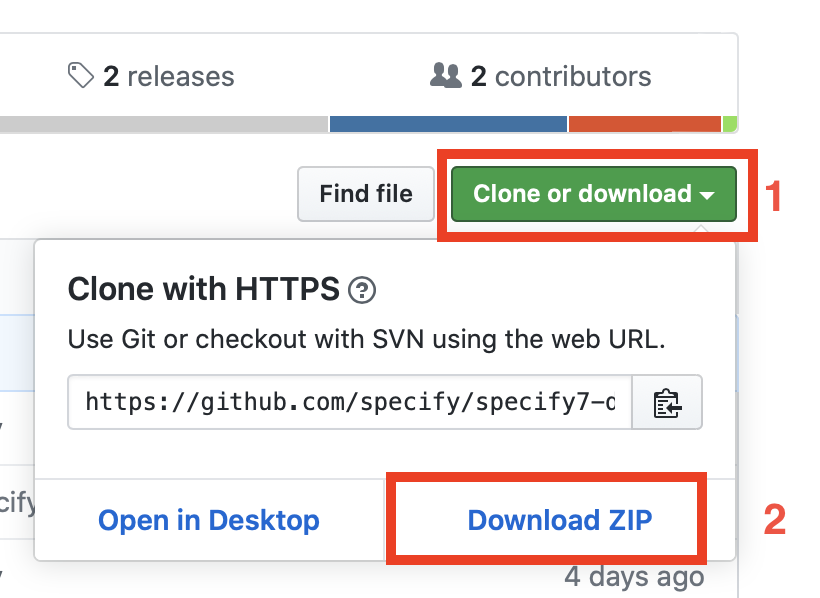
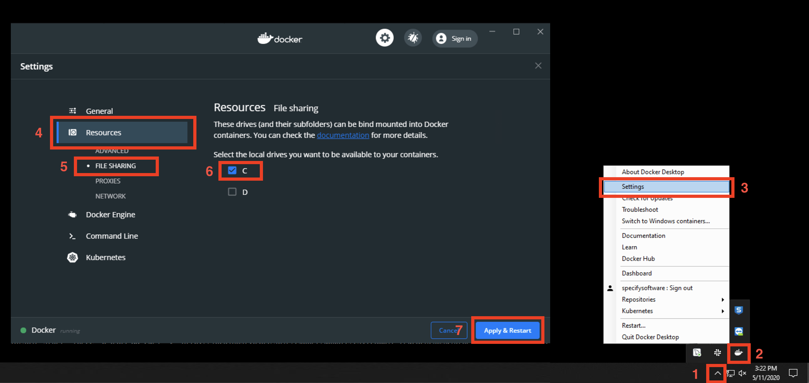

# Specify 7 and Web Portal in Docker

Dockerized version of [Specify 7.4.0](https://github.com/specify/specify7) and [Web Portal 2.0](https://github.com/specify/webportal-installer).

* [Installation](#Installation)
* [Upgrade from Specify 7.3.1 to Specify 7.4.0](#upgrade-from-specify-731-to-specify-740)

## Installation

* Install Docker Desktop ([macOS](https://hub.docker.com/editions/community/docker-ce-desktop-mac/), [Linux](https://docs.docker.com/engine/install/ubuntu/), [Windows](https://hub.docker.com/editions/community/docker-ce-desktop-windows/)) and make sure it is running

* Download this repository:
  1. You can either press the button at the top right corner of this page and then press `Download ZIP`, unzip the downloaded file and place it into a convenient location
  
  1. OR install **Git**, open terminal, navigate to a convenient location and run the following command
  ```bash
    git clone https://github.com/specify/specify7-docker.git
  ```

* If you want to use your own database with specify7, replace `mariadb/database.sql` with an export of your database. Be sure to name it `database.sql`

* If you want to use your own data for WebPortal, replace `webportal/export.zip` with your export file. Be sure to name it `export.zip`. You can use the Specify Data Export tool to create a Web Portal export zip file ([see the Specify 6 Data Export documentation](https://www.sustain.specifysoftware.org/wp-content/uploads/2017/03/Using-the-Specify-Web-Portal.pdf))

* **[For Windows hosts only]** Follow these instructions in order to avoid getting Drive-related error messages:
  1. Press on the arrow button in your Start Menu
  1. find the docker logo and click on it
  1. Select `Settings` in the list of options
  1. Press on the `Resources` tab
  1. Press on the `File Sharing` submenu
  1. Select the drive where your `specify7-docker` is located (It is drive `C` in most cases)
  1. Press `Apply & Restart` and wait for Docker to fully reboot (as shown by the indicator in the lower-left corner of the window)
  

* Build the Docker image and start the container:
  1. Open the terminal (or Command Prompt) in the `specify7-docker` (use `cd specify7-docker` to open the directory)
  1. Run the `docker-compose up -d` command
  1. The building process can take about 15 minutes

Specify 7 instances should now be available at `http://localhost:8080`.
  
WebPortal instance should now be available at `http://localhost:80`.
  
Solr admin panel should now be available at `http://localhost:8983`. You can restrict access to Solr from outside the container by commenting out the `8983:8983` line in `docker-compose.yml`

You can build containers without Specify7. In such a case, you can comment out respected sections for `mariadb` and `specify7` in `docker-compose.yml` as well as the `networks` part
  
You can build containers without Webportal. In such case, you can comment out the `webportal` section in `docker-compose.yml`

If you want to run Specify7 with a local SQL server, follow [these instructions](https://github.com/specify/specify7-docker/tree/sp7_only)

* To stop the container:
  ```bash
    docker-compose stop
  ```
* To destroy the container:
  ```bash
    docker-compose down
  ```
* To rebuild the container (for example for a new release of Specify 6):
  ```bash
    docker-compose up -d --build
  ```


## Upgrading to a newer version of Specify7

To run a newer version of Specify7, all you have to do copy the Specify 6 client's `specify.jar` and `config/` folder into `specify7/specify6_thick_client` and make sure the database you want to connect to has been upgraded to the new version.

Then:

* Pull the changes from the GitHub repository:

  ```bash
    git pull origin master
  ```

* Destroy the container:

  ```bash
    docker-compose down
  ```

* Rebuild the container:

  ```
    docker-compose up -d --build
  ```

## TODO

* Right now, Specify7 container has an Apache webserver. Also, Web Portal container uses Nginx. Ideally, there should be a separate container for Nginx and Specify 7 with Web Portal should connect to it

* We can uninstall most packages from Specify7 and Web Portal after the build process is over
